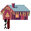

# Project 1

In this game you snowboard down the hill.



## Dependecies

- haxeflixel
- lime

## Build

```
lime build neko
```

## Usage

Arrow keys to move left, right up or down, or use w,a,s,d.
Use **Shift** to drift for faster turns when needed.

The goal is to get as many points as possible

## Design

The boarder tries to dodge trees as he goes down the hill.

Turning down the hill is slow so there is a mechanic were you can 'drift' or 'oversteer' to turn faster but lose speed by holding shift

It was annoying to keep hitting up and down to stay in the middle of the screen with the boarder so there is a push that pushes harder depending on how high or low the boarder is on the screen.

Since the sharp turning using shift gives you more control I thought it would be cool to use it too incentivise higher control with the 'near misses' to give points.

## Implementation

```haxe
// horizontal boarder movement
update() {
	boarder.acceleration.x = 0;
	if (keys.anyPressed([LEFT, A]))
	{
		boarder.acceleration.x = -BOARDER_ACCELERATION;
	}
	else if (keys.anyPressed([RIGHT, D]))
	{
		boarder.acceleration.x = BOARDER_ACCELERATION;
	}
}
```

horizontal movement is just the acceleration added and set to zero when a,d,left,right are not pressed.

```haxe
absVelocity = abs(boarder.velocity.x);
if (absVelocity < 40)
{
	boarder.animation.play("0");
}
else if (absVelocity < 100)
{
	boarder.animation.play("1");
}
else if (absVelocity < 200)
{
	boarder.animation.play("2");
}
else if (absVelocity < 300)
{
	boarder.animation.play("3");
}
else
{
	boarder.animation.play("4");
}
```

Plays an animation that corresponds to how fast the player is moving horizontally at a different angle.


Flips the images for left movement.

```haxe
_shadow.exists = true;
_shadow = new FlxSprite(boarder.x, boarder.y, "assets/images/shadow.png");
_shadow.velocity.x = boarder.velocity.x;
_shadow.velocity.y = boarder.velocity.y;
add(_shadow

_jumper.exists = true;
_jumper = new FlxSprite(boarder.x, boarder.y, "assets/images/board_jump.png");
_jumper.scale.set(3, 3);
_jumper.velocity.x = boarder.velocity.x;
_jumper.velocity.y = boarder.velocity.y;
_jumper.velocity.y -= 800;
_jumper.acceleration.y = 1100;
add(_jumper)

boarder.exists = false;
return;
```

This logic starts the jumping animation off of the snow jumps

## Shortcomings

I wish I had time to scale the speed, It wouldn't be hard to add it would be simple. I already had a variable set up for that sort of thing.

The place where the boarder settles shouldn't be in the middle of the screen but near the top to give the player more time to react.

The code that manipulates how fast the boarder is going down the hill is kind of hacky and I should've used acceleration better and tried to make it additive instead of assigning it all the time.

It is also an easy addition to increase the chance of trees spawning which would have increased over time to make the game more difficult over time.

### Credit

**Ben Puhalski. Game Programming - Lakehead**
